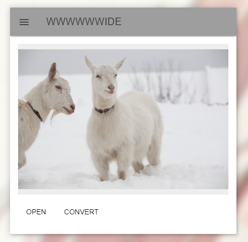

# wwwwwwide
wall paper generater for wwwwwwide screen like 21:9 and 31:9

wwwwwwide 는 모니터와 맞지 않는 사이즈의 배경화면의 빈공간을 원본 이미지를 이용하여 매꾸어 주는 소프트웨어입니다.

node.js 를 바탕으로 작성 되었으며 electron, jimp, mdl 을 이용하여 작성 되었습니다.

# how to use

사용법이 그리 어렵지 않을 것 입니다.

OPEN 버튼을 열고 파일 탐색기를 통해 수정하고자 하는 이미지를 선택합니다.
이후 CONVERT 버튼을 눌러 이미지를 변환합니다.
이때 변환된 이미지는 원본 이미지를 덮어씌웁니다.
화면 사이즈는 메인디스플레이 기준으로 인식이 됩니다.

# Download

[windows x64](https://github.com/keepworking/wwwwwwide/releases/download/1.0/win64.wwwwwwide.Setup.1.0.0.exe)

[windows x32](https://github.com/keepworking/wwwwwwide/releases/download/1.0/win32.wwwwwwide.Setup.1.0.0.exe)
